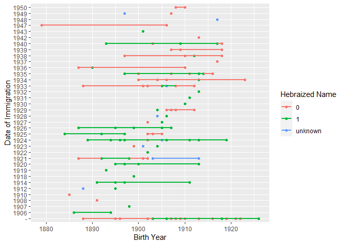

Israel MK Analysis
================

The Members of the Knesset (MK) database, houses biographical
information in spreadsheet format of nearly 1200 individuals who served
in the Israeli Knesset from 1949 to 1977.

Israel is composed of a vast array of Jewish groups from across the
world, considering its foremost state policy is to encourage the growth
of its citizenry through Jewish emigration or Aliyah. Aside from the
native Druze, Bedouin and Arab citizens of Israel, its Jewish
inhabitants are almost entirely immigrants or descendents of immigrants
who arrived in Ottoman Palestine, Mandatory Palestine and Israel after
the 1880s. This database aims to catalog the origins of members of the
Israeli Knesset, which is the preeminent lawmaking body of the State of
Israel. The aims are sixfold:

1)  To compare patterns of Jewish immigration to the ethnic and regional
    composition of the Knesset over time.

2)  To examine how regional background, broad ethnic division, gender,
    age and type of birth locality tie to party membership in the
    Knesset over time.

3)  To analyze how the age and gender of MKs relate to ethnic and
    regional background over time.

4)  To pinpoint ideological variations in MKs born in Israel/Mandatory
    Palestine and those of foreign birth who immigrated to Israel over
    time.

5)  To view patterns of the “Hebraization” of Israeli political leaders
    over time.

6)  To link ethnic and regional attributes to geospatial data for public
    viewing.

``` r
library(tidyverse)
library(kableExtra)
library(psych)

df = read.csv("1949-1951.csv")
kable(head(df))
```

| Knesset   | Party | Name              | Gender | Age | Birth.Year | Birth.Name          | Hebraized.Name. | Birthplace | Type.of.Birth.Locality | Birth.Region               | Birth.Country  | Birth.Country..Present. | Date.of.Immigration | Community | Notes |
|:----------|:------|:------------------|:-------|----:|-----------:|:--------------------|:----------------|:-----------|:-----------------------|:---------------------------|:---------------|:------------------------|:--------------------|:----------|:------|
| 1949-1951 | Mapai | Meir Argov        | Male   |  43 |       1905 | Meyer Grabovsky     | 1               | Rîbnița    | Town                   | Podolsk Governorate        | Russian Empire | Moldova                 | 1927                | Ashkenazi |       |
| 1949-1951 | Mapai | Ami Assaf         | Male   |  45 |       1903 | Ami Vilkomitz       | 1               | Rosh Pinna | Rural Community        | Beirut Vilayet             | Ottoman Empire | Israel                  | \-                  | Ashkenazi |       |
| 1949-1951 | Mapai | Zalman Aran       | Male   |  49 |       1899 | Zalman Aharonowitz  | 1               | Yuzovka    | City                   | Yekaterinoslav Governorate | Russian Empire | Ukraine                 | 1926                | Ashkenazi |       |
| 1949-1951 | Mapai | Yitzhak Ben-Zvi   | Male   |  64 |       1884 | Izaak Shimshelevich | 1               | Poltava    | City                   | Poltava Governorate        | Russian Empire | Russia                  | 1907                | Ashkenazi |       |
| 1949-1951 | Mapai | Aryeh Bahir       | Male   |  42 |       1906 | Aryeh Geller        | 1               | Odessa     | City                   | Kherson Governorate        | Russian Empire | Ukraine                 | 1924                | Ashkenazi |       |
| 1949-1951 | Mapai | David Bar-Rav-Hai | Male   |  54 |       1894 | David Borovoi       | 1               | Nizhyn     | Town                   | Chernigov Governorate      | Russian Empire | Ukraine                 | 1924                | Ashkenazi |       |

``` r
ggplot(df, aes(Birth.Year, Date.of.Immigration, colour = Hebraized.Name.)) + 
  geom_point() +  
  geom_smooth(method=lm, se=FALSE) + labs(x = "Birth Year", y = "Date of Immigration", color = "Hebraized Name")
```

<!-- -->

``` r

ggplot(df, aes(x = Birth.Country..Present., fill = Party)) + 
  geom_bar(width = 0.5) + 
  theme_minimal() + 
  labs(x = "Birth Country of Winning Candidates", y = "Number of Winning Candidates", fill = "Party") + 
  theme(axis.text.x = element_text(angle = -90), text = element_text(size = 7)) +  
  scale_fill_manual(values = c("#AF0000", "#0038B8", "#00ADCC", "#0077B9", "#FF524D", "#AD0101", "#FF0000", "#FFC800", "#0047AB", "#172d81", "#cd1b68", "#89C5C6"))
```

<!-- -->
